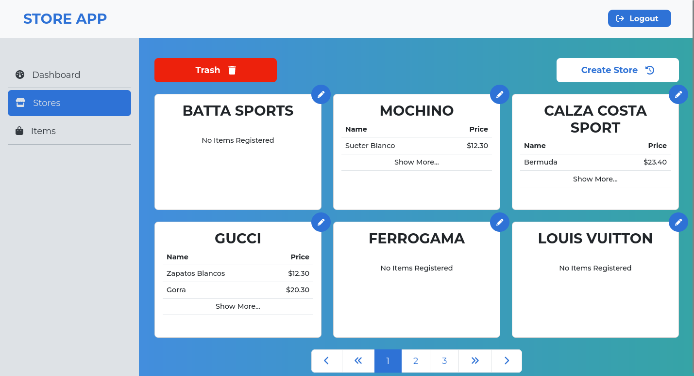

# Aplicacion Cliente para la Store-API Rest

Se trata de una aplicación que administra los recursos API
del servicio que se pidió desarrollar en la prueba de desarrollador.

Esta aplicación está desarrollada con React.js, Redux, Typescript,
Vite.js y buenas prácticas de para la obtención de un producto de
calidad y mantenible.

## Entorno de ejecucion

Para poder correr la aplicación, debemos asegurarnos de que el servidor que contiene el API está corriendo correctamente.
Luego de eso podemos situarnos en la raíz del proyecto y
ejecutar el siguiente comando.

```
yarn dev
```

_Esto ejecutará la aplicación en el entorno local con
el puerto que esté disponible en ese momento.
Por lo general es el puerto 5173._

### Screenshots

| Web                                       | Movil                                        |
| ----------------------------------------- | -------------------------------------------- |
|      |      |
|  |  |
|     |     |
|      |      |

## Caracteristicas

- React.js
- Redux-Toolkit
- Vite.js
- Bootstrap CSS
- Styled Components
- Responsive Plataform
- Typescript

## Autores

- [@jrdeavila](https://www.github.com/octokatherine)
